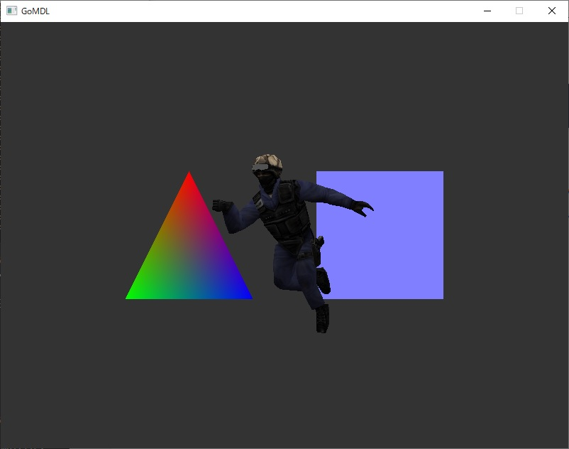
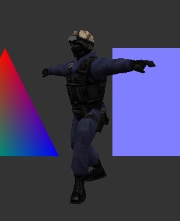
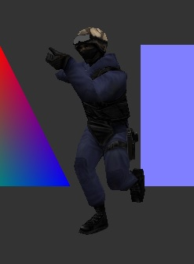

# gomdl

この Go 言語のコードは Valve 社の Half-Life 1 エンジンで使用されている MDL ファイルのビュワーです。  
[mdlviewer](https://github.com/ValveSoftware/halflife/tree/master/utils/mdlviewer) を参考に Go 言語で新たに記述しました。  
MSYS2 版 Go 1.17 で動作確認しています。

## 実行環境のセットアップ

`MSYS2 MSYS` のシェルで以下のコマンドを実行します。
~~~
$ pacman -S base-devel
$ pacman -S mingw-w64-x86_64-toolchain
$ pacman -S mingw-w64-x86_64-go
$ pacman -S git
$ pacman -S mingw-w64-x86_64-SDL2{,_image,_mixer,_ttf,_gfx}
~~~

## ビルド

`MSYS2 MinGW x64` のシェルで以下のコマンドを実行します。  
ビルドが成功すると、カレントディレクトリに `gomdl.exe` が生成されます。
~~~
$ git clone https://github.com/takaya030/gomdl
$ cd gomdl
$ go mod tidy
$ go build
~~~

## 実行

`MSYS2 MinGW x64` のシェルで表示する MDL ファイル名を指定して起動します。
~~~
$ ./gomdl.exe <mdlfile>
~~~

ウィンドウが開いてモデルが表示されます。  
アニメーションデータが含まれている場合はアニメーションも再生されます。  
  

スペースキーを押す毎にアニメーションが切り替わります。  
  
  
  
  

## 操作方法

~~~
キーボード
SPACE: アニメーション切り替え
Z: モデルのローテーション初期化

マウス
L ボタン押しながら左右移動: モデルの Y 軸周りの回転
R ボタン押しながら上下移動: モデルの X 軸周りの回転
~~~